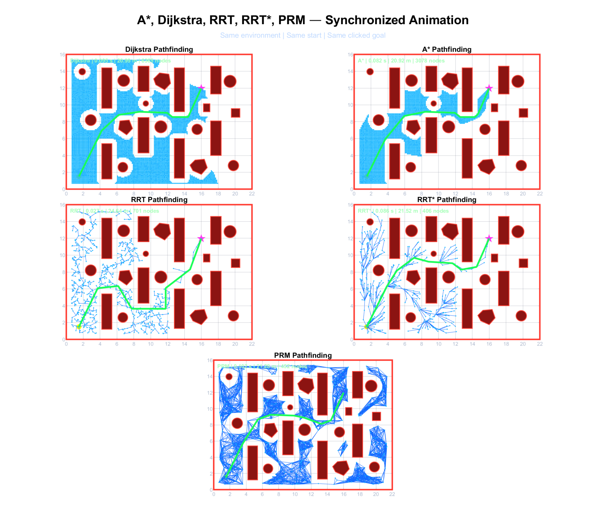
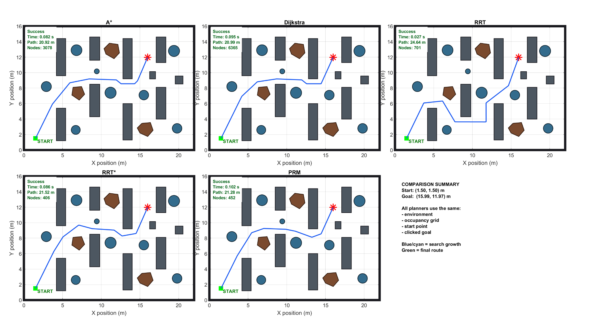
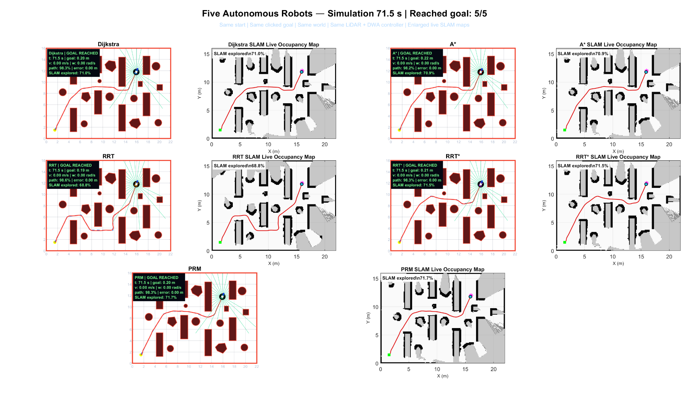
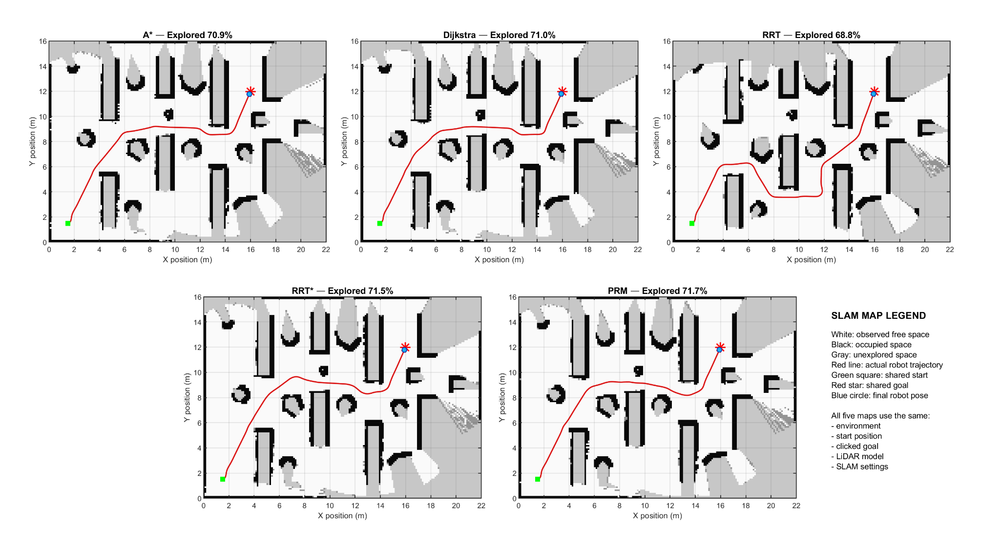

# Multi-Algorithm Robot Navigation with Live SLAM

A MATLAB simulation for comparing five global path-planning algorithms under a shared autonomous-navigation setup:

- A*
- Dijkstra
- RRT
- RRT*
- PRM

Each planner receives the same start position, user-selected goal, obstacle map, safety-inflated occupancy grid, differential-drive robot model, simulated 360-degree LiDAR, Dynamic Window Approach (DWA) controller, path follower, and live occupancy-mapping configuration.

## Project highlights

- Synchronized comparison of five planners
- Interactive selection of one shared collision-free goal
- Planning search animations and final path comparison
- Simultaneous navigation of five autonomous robots
- DWA-based local motion and obstacle avoidance
- Simulated LiDAR and independent live occupancy maps
- Automatic CSV, MAT, PNG, and AVI exports
- Fixed random seed for repeatable environment generation

## Example output

The following images and tables come from the example run included in this repository.

### Synchronized planning animation

The final animation frame shows the search expansion and selected route for all five planners. Click the preview image or the link below to open the video.

[](results/planning_algorithms_comparison_animation.mp4)

[▶ Watch the synchronized planning animation](results/planning_algorithms_comparison_animation.mp4)

### Final planning comparison



| Algorithm | Path found | Planning time (s) | Planned path (m) | Search nodes |
|---|---:|---:|---:|---:|
| A* | Yes | 0.0815 | 20.9219 | 3,078 |
| Dijkstra | Yes | 0.0948 | 20.9898 | 6,365 |
| RRT | Yes | 0.0266 | 24.6369 | 701 |
| RRT* | Yes | 0.0856 | 21.5217 | 406 |
| PRM | Yes | 0.1024 | 21.2804 | 452 |

### Five-robot navigation dashboard

[](results/multi_algorithm_robot_navigation.mp4)

[▶ Watch the five-robot navigation video](results/multi_algorithm_robot_navigation.mp4)

### Final live SLAM maps



| Algorithm | Goal reached | Completion (s) | Travelled (m) | Tracking RMSE (m) | Minimum clearance (m) | Guard events | Explored (%) |
|---|---:|---:|---:|---:|---:|---:|---:|
| A* | Yes | 71.52 | 20.7180 | 0.0190 | 0.6276 | 0 | 70.86 |
| Dijkstra | Yes | 70.64 | 20.7561 | 0.0207 | 0.6270 | 0 | 71.04 |
| RRT | Yes | 70.32 | 24.2301 | 0.0350 | 0.6501 | 0 | 68.83 |
| RRT* | Yes | 61.92 | 21.2850 | 0.0230 | 0.6549 | 0 | 71.46 |
| PRM | Yes | 64.64 | 21.1023 | 0.0265 | 0.6375 | 0 | 71.68 |

For this run, all five robots reached the goal and recorded zero collision-guard events. RRT planned fastest but produced the longest route. A* produced the shortest planned route and lowest tracking RMSE. RRT* completed navigation fastest and maintained the greatest minimum clearance. PRM explored the largest fraction of the map.

These observations describe one example run only. They are not statistical evidence that one planner is generally superior.

## Requirements

- MATLAB; R2020a or newer is recommended
- A desktop session capable of showing interactive figures
- No third-party packages

The project implements the planners, collision checking, DWA controller, simulated LiDAR, and occupancy mapping in the included MATLAB files.

## Quick start

1. Download or clone this repository.
2. Open the project folder as the MATLAB **Current Folder**.
3. Run:

```matlab
clear functions
clear
clc
close all
main
```

4. Click one free point in the displayed environment to set the shared goal.
5. Wait for planning, animation, navigation, mapping, and export to finish.

The example run used:

- Start: `(1.50, 1.50)` m
- Goal: `(15.99, 11.97)` m
- Environment random seed: `37`

## Repository structure

```text
.
├── GITHUB_UPLOAD_GUIDE.md
├── main.m
├── utilities.m
├── comparePlanningAlgorithms.m
├── animatePlanningAlgorithms.m
├── animateMultiRobotNavigation.m
├── planPathAStar.m
├── planPathDijkstra.m
├── planPathRRT.m
├── planPathRRTStar.m
├── planPathPRM.m
├── pathFollower.m
├── dynamicWindowApproach.m
├── evaluateTrajectory.m
├── terminalGoalController.m
├── initializeSlamMap.m
├── updateSlamMap.m
├── exportFiveSlamMaps.m
├── simulateLidar.m
├── robotKinematics.m
├── drawRobot.m
├── collisionCheck.m
├── buildOccupancyGrid.m
├── postProcessPath.m
├── createEnvironment.m
├── plotEnvironment.m
├── goalSelection.m
├── hideAxesToolbars.m
└── results/
    ├── planning_algorithms_comparison_animation.mp4
    └── multi_algorithm_robot_navigation.mp4
```

## Generated files

Running `main.m` writes the following files to `results/`:

```text
planning_algorithms_comparison_animation.avi
planning_algorithms_animation_final.png
planning_algorithm_comparison.png
planning_algorithm_comparison_metrics.csv
multi_algorithm_robot_navigation.avi
multi_algorithm_robot_navigation_final.png
multi_algorithm_robot_navigation_metrics.csv
slam_live_occupancy_map.png
navigation_results.mat
navigation_results.csv
multi_algorithm_project_results.mat
```

## Included video demonstrations

The two included H.264 MP4 files are compressed GitHub-friendly versions of the MATLAB-generated AVI files:

```text
results/planning_algorithms_comparison_animation.mp4
results/multi_algorithm_robot_navigation.mp4
```

The repository keeps the MP4 demonstrations and lightweight example PNG/CSV files. Generated AVI and MAT files remain ignored because they are large or reproducible.

## Reproducibility

`main.m` resets MATLAB, loads the shared configuration, and seeds the random-number generator before creating the environment and running the planners. The clicked goal is not fixed, so selecting a different goal changes the output. Planning times also depend on the computer and MATLAB release.

For a defensible algorithm study, run many trials across multiple seeds, environments, and goals, then report distributions or confidence intervals instead of relying on this single demonstration.

## Limitations

- This is a MATLAB simulation, not a ROS, Gazebo, or real-robot deployment.
- LiDAR measurements, vehicle dynamics, and occupancy mapping are simplified.
- The live maps are simulation outputs and are not validated against physical sensors.
- The example metrics represent one environment and one selected goal.
- A public repository needs an explicit license if others should be allowed to reuse the code.
